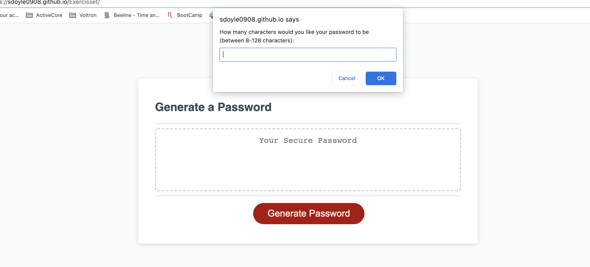
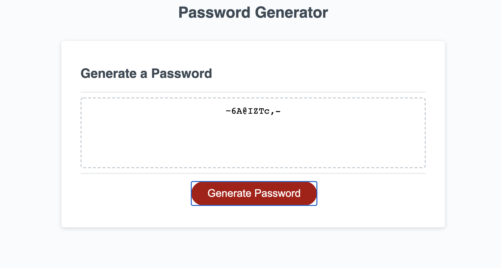

# JavaScript Challenge: Password Generator

For this weeks challenge we were given an assignment to create an application that an employee can use to generate a random password. I was able to do so by using dynamically updated HTML and CSS powered by JavaScipt code that I wrote.

## Screenshot Description

Screenshots below show my Password Generator uploaded in Git Pages:

### Screenshot 1

1. Displays the Password Generator after the user has hit the generate button and is prompted to enter the amount of characters they would like to use in their password.
2. After this information is added, they are then provided other prompts to help determine what types of characters they would like to use in their password such as uppercase, numbers, and special characters.

### Screenshot 2

1. Displays the randomly generated password after all the prompts are answered.
2. In this instance the user opted for a password with 10 characters as well as to use uppercase, numbers and special characters.

## URL's

- [URL of the GitHub repository](https://github.com/sdoyle0908/Exercisset)
- [URL of deployed application](https://sdoyle0908.github.io/Exercisset/)
